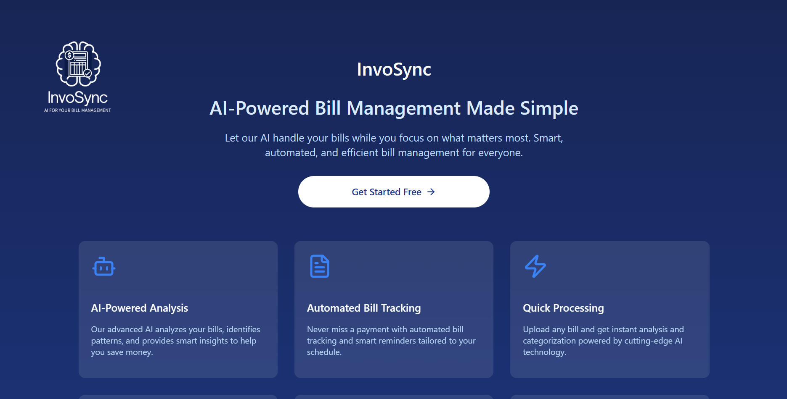

<div align="center">
  
  <h1>InvoSync</h1>
  <p>A powerful AI-driven system that automates the extraction and population of invoice data into predefined templates—streamlining operations for organizations and reducing manual workload.</p>
</div>

## 🌟 Overview

**InvoSync** is a next-gen Intelligent Document Processing (IDP) platform that uses OCR and GenAI to read invoices and auto-fill structured formats such as Excel sheets or ERP entries. Designed to eliminate manual data entry, AutoBill ensures faster, more accurate, and scalable document processing.

## 🎯 Key Features

- **📤 Multi-format Document Upload**
  - Upload PDFs, scanned images, photos, or emails.

- **🔍 OCR-based Text Extraction**
  - Extract text using powerful OCR tools like Tesseract or Google Vision.

- **🤖 GenAI-powered Data Extraction**
  - Extract fields like invoice number, vendor, amount, date, and tax using LLMs.

- **📋 Template Auto-fill**
  - Automatically fill Excel/Google Sheets templates or integrate with ERP systems.

- **👨‍💻 Human-in-the-Loop Review**
  - Enable optional manual verification and editing before submission.

- **📊 Dashboard & Analytics**
  - View status, accuracy, and trends of processed invoices.

- **🔐 Security & Compliance**
  - Role-based access control and audit trails for transparency and safety.

## 🧠 Solution Flow

1. **Document Ingestion**
   - Upload via web interface or email parsing.
   - Supports PDF, JPG, PNG, TIFF formats.

2. **OCR Processing**
   - Converts image-based documents to machine-readable text.

3. **Preprocessing**
   - Image enhancement, noise removal, text cleanup.

4. **Field Extraction via GenAI**
   - Uses GPT or Claude to pull structured data from raw text.

5. **Template Auto-filling**
   - Populates Excel/Google Sheets or posts to ERP via APIs.

6. **Review & Approval Layer**
   - Users can verify/edit data before final submission.

7. **Storage & Logging**
   - Saves bill metadata and audit trails in the database.

8. **Reporting Tools**
   - Visual dashboards showing stats, trends, and insights.

## 🔧 Technology Stack

### 🧠 AI/ML
- Gen AI: Gemini Flash 2.0
- OCR: Easyocr - FOSS Vision model

### 💻 Backend
- Python (Flask)
- Node.js (For routing/microservices)

### 🖥 Frontend
- React.js
- Tailwind CSS


### 📦 Database
- Supabase
- PostgreSQL (Flexible document storage)

### 📄 Template Integration
- openpyxl, pandas (Excel automation)

### 📊 Analytics
- Rechart, React-admin + Chart.js,

### 🔒 Security
- Supabase Auth
- React router for protection

## 🛠 Optional Add-ons

- **📧 Email Integration:** Auto-fetch invoices from inbox.
- **🌐 Multi-language OCR:** Translate invoices using GenAI.
- **🔁 RPA Support:** Automate legacy ERP input using UiPath.
- **📌 Duplicate Detection:** Prevent duplicate invoice processing.

## 🚀 Getting Started

### Prerequisites
```bash
node >= 14.0.0
npm >= 6.0.0
Python >= 3.8
Supabase
popple
```

### Installation

1. Clone the repository
```bash
git clone https://github.com/yourusername/autobill.git
cd autobill
```

2. Install dependencies
```bash
# Backend
cd backend
pip install -r requirements.txt

# Frontend
cd ../frontend
npm install
```

3. Configure environment variables
```bash
# Create .env file in the backend directory
cp .env.example .env
# Edit .env with your API keys and database credentials
```

4. Run the application
```bash
# Start backend
cd backend
python app.py

# Start frontend (in a new terminal)
cd frontend
npm start
```

5. Open your browser and navigate to `http://localhost:3000`

## 📝 Usage

1. Log in to your account or sign up
2. Upload an invoice via the dashboard
3. The system will automatically extract data
4. Review the extracted information
5. Approve or edit as needed
6. Export to your preferred template or ERP system

## 🧪 Testing

```bash
# Run backend tests
cd backend
pytest

# Run frontend tests
cd frontend
npm test
```

## 🤝 Contributing

1. Fork the repository
2. Create your feature branch (`git checkout -b feature/amazing-feature`)
3. Commit your changes (`git commit -m 'Add some amazing feature'`)
4. Push to the branch (`git push origin feature/amazing-feature`)
5. Open a Pull Request

## 📜 License

This project is licensed under the MIT License - see the LICENSE file for details.

## 📞 Contact

Project Link: [https://github.com/yourusername/autobill](https://github.com/yourusername/autobill)

## 🙏 Acknowledgments

- OpenAI for GPT models
- Google for Vision API
- All open-source libraries used in this project